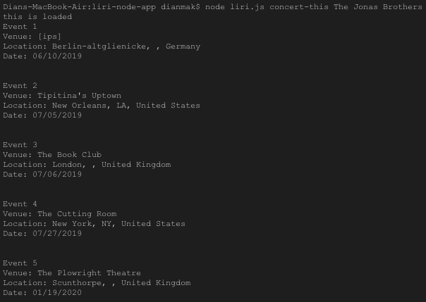

# liri-node-app

LIRI is like iPhone's SIRI. However, while SIRI is a Speech Interpretation and Recognition Interface, LIRI is a _Language_ Interpretation and Recognition Interface. LIRI will be a command line node app that takes in parameters and gives you back data from APIs.

**How To Use**
LIRI has four commands:
1. concert-this *<artist/band name here>*
Users are able to input the name of a band or artist and receive the search results of that query from the BandsInTown API in the form of:

Venue name
Venue location
Date of event (MM/DD/YYYY)

2. movie-this *<movie title here>*
Users are able to input the title of a movie and receive the search results of that query from the OMDB API in the form of:

Title of the movie.
Year the movie came out.
IMDB Rating of the movie.
Rotten Tomatoes Rating of the movie.
Country where the movie was produced.
Language of the movie.
Plot of the movie.
Actors in the movie.

3. spotify-this-song *<song title here>*
Users are able to input the title of a song and receive the search results of that query from the Spotify API in the form of:

Artist(s)
The song's name
A preview link of the song from Spotify
The album that the song is from

4. do-what-it-says
LIRI will read input from random.txt file and execute one of the above processes depending on the contents of the file. 

**Screenshots**

**API and NPM Reference**

* [Node-Spotify-API](https://www.npmjs.com/package/node-spotify-api)

* [Axios](https://www.npmjs.com/package/axios)

* You'll use Axios to grab data from the [OMDB API](http://www.omdbapi.com) and the [Bands In Town API](http://www.artists.bandsintown.com/bandsintown-api)

* [Moment](https://www.npmjs.com/package/moment)

* [DotEnv](https://www.npmjs.com/package/dotenv)

